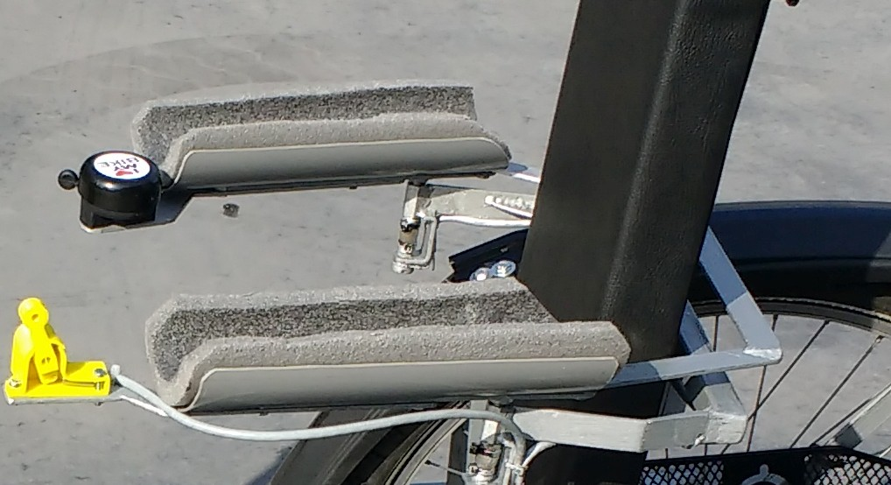

# Een fiets op maat voor Morgan

Morgan wil gewoon kunnen fietsen zoals haar vriendinnen, maar ze heeft een ernstige huidziekte waardoor ze weinig kracht heeft in haar benen en haar vingers zijn te kort om stevig een fietsstuur te kunnen vastnemen of om te remmen. 

## Haar droomfiets
Morgan had zelf haar droomfiets getekend:

Specifieke kenmerken die de fiets zeker moest hebben: drie wielen, zachte zetel, grijze kleur, haar naam in oranje letters en een tasje om haar gsm mee te nemen.

## Speciale driewieler

Maker Ronald Van Ham heeft een speciale driewieler gemaakt voor Morgan, die bestaat uit een aantal deeloplossingen:

1. **Aandrijving**: de trappers geven geen weerstand, maar een sensor leest uit hoe snel ze draaien en de motor op het voorwiel  wordt door deze beweging aangestuurd.
2. **Stuur**: een speciaal stuur werd ontwikkeld waarbij Morgan niets dient vast te nemen met haar handen, maar waar ze gewoon haar onderarmen kan inleggen. De beweging wordt gemeten door een potentiometer  en een servomotor gaat het eigenlijke stuur laten bewegen. 
3. **Remmen**: Morgan kan geen gewone fietsrem bedienen. Daarom is er een speciale kleine hendel met een veertje in gemaakt die Morgan naar zich toe kan trekken als ze wil fietsen. Laat ze deze los gaat de fiets remmen,  ook als ze nog zou trappen.  Hiernaast is er ook een mechanische voetrem gemaakt. 
4. **Zachte instelbare zetel**
5. **Frame met 3 wielen**

Alle controle en aansturing gebeurt door twee arduino nanos, één van voor en één van achter. Deze twee arduino nanos communiceren met elkaar via I2C. De reden om twee arduino's te gebruiken is omdat er anders via een analoog signaal gecommuniceerd moet worden van de potentiometers en dit veel storing geeft. Via I2C kan er via een digitaal signaal gecommuniceerd worden en blijft de storing beperkt.

- [code arduino vooraan](FietsArduinoVoorFinal/FietsArduinoVoorFinal.ino)
- [code arduino achteraan](FietsArduinoAchterFinal/FietsArduinoAchterFinal.ino)

## Aandrijving
### Motor

Een 250W MY1016Z-1 motor staat op het voorwiel gemonteerd. Deze DC motor met ingebouwde tandwielkast wordt gebruikt om gewone fietsen om te bouwen tot elektrische fietsen. Met een kettingoverbrenging tussen de motor en de as van het voorwiel wordt de snelheid verminderd en het koppel verhoogd.  De motor kan naar boven geschoven worden om de ketting de juiste spanning te geven. Er is ook in plexi een afschermkap gemaakt rond de ketting.

De aansturing van de motor gebeurt door de snelheid van de trappers uit te lezen via een optische encoder die aan de trappers gekoppeld is. Een optische encoder bestaat uit een schijfje met zwarte en doorschijnende lijntjes op.

Door aan de ene kant een lampje te zetten en door op 2 plaatsen aan de andere kant te kijken of het licht er door kan, weet je in welke richting je draait en ook hoe snel. Precies de informatie die we nodig hebben van de trappers. Dergelijke optische encoder kan je zelf maken of kopen in een metalen behuizing:

Hierdoor weet de Arduino dus hoe snel Morgan trapt en of ze vooruit of achteruit wil rijden. De Arduino gaat met deze info, samen met een potentiometer waarmee Morgan de maximum snelheid kan instellen, 2 PWM signalen genereren voor de H-brug.

Deze BTS7960B H-brug laat de motor dan vooruit of achteruit draaien met een bepaalde snelheid. De snelheid van de trappers wordt omgezet naar een vermogen dat vervolgens naar de motor wordt gestuurd. Dit gaat natuurlijker overkomen en minder bruusk de fiets laten voorbewegen. Om de laatste schokken te beperken, werd er een  software filter in de Arduino geprogrammeerd. Dit gaat bruuske veranderingen in de gevraagde snelheid (trapsnelheid) tegengaan. Alles van de aandrijving is in de achterste Arduino geprogrammeerd.

### Stuur

Morgan legt haar armen in twee zachte stukken buisisolatie, die scharnierend zijn opgesteld onder haar ellebogen. De 2 kanten zijn langs achter verbonden met elkaar zodat de onderarmen evenwijdig blijven. 

Onder elk scharnier is een potentiometer gezet om de hoek uit te lezen. Deze 2 zouden ongeveer dezelfde hoek moeten geven. Dit noemt men redundantie. De Arduino achteraan gaat deze beide hoeken uitlezen en gaat checken of het verschil niet te groot is. Bij een te groot verschil stopt de fiets, want dan is er iets grondig mis en dat kan leiden tot een gevaarlijke situatie.

Als het verschil voldoende klein is, wordt het gemiddelde gemaakt en digitaal doorgestuurd naar de Arduino vooraan. Een digitaal signaal bestaat uit 1 en 0, ofwel hoog en laag. We kunnen dit bekijken op een oscilloscoop: 

Een analoog signaal langs de vermogendraden van de aandrijfmotor en stuurmotor laten gaan geeft ruis op het stuursignaal en dit laat het stuur schokken. Het signaal filteren laat het stuur trager reageren, vandaar de oplossing met 1 Arduino Nano vooraan en 1 achteraan. 

De Arduino vooraan krijgt de gewenste stuurpositie aan. Hij vergelijkt deze met de positie van het echte fietsstuur en bepaalt hieruit of de motor op het stuur links of rechts moet draaien, en ook hoe snel. De motor op het stuur is een ruitenwissermotor uit een auto. Dit zijn zeer robuuste DC motoren op 12V met een grote ingebouwde vertraging. De aansturing tussen de Arduino en de motor is weer dezelfde H-brug als voor de aandrijfmotor. De software in de Arduino kan getuned worden zodat het stuur voldoende snel de armen volgt en toch niet gaat schokken.

Dit geheel is eigenlijk een servo systeem. De hoek van de armen is het gevraagde signaal. Dit wordt vergeleken met de huidige positie van het stuur, wat kan aangepast worden door de motor. De Arduino vergelijkt de 2 hoeken en stuurt de motor aan om het verschil nul te maken. De testopstelling van de servo motor zag er zo uit:

### Remmen
Eerst werd er geopteerd voor een remhendel. Dus wanneer Morgan dit ‘knopje’ naar zich toe trok, remde de motor. Dit is geen digitaal knopje, maar een potentiometer zodat de Arduino weet hoe hard Morgan wil remmen.

Doordat de trappers nog konden blijven draaien, startte de fiets soms terug als ze deze hendel los liet. Dit was niet aangenaam en soms zelfs een beetje gevaarlijk.
Daarom is de werking omgedraaid.

Nu is het een zogenaamde ‘dodemansknop’ geworden. Dit wil zeggen dat Morgan deze hendel steeds naar zich moet trekken als ze wil dat de fiets rijdt, anders remt de motor op het voorwiel. Het stuur blijft wel werken. Dus moest Morgan schrikken, stopt de fiets sowieso, maar ze kan wel blijven sturen. Dit geeft een veiligere werking. De fiets gaat niet heel snel rijden en de rem gaat geleidelijk aan afremmen. Dit stuk software zit ook in de achterste Arduino.

Volledig los van de sofware, elektronica en motoren is er een mechanische voetrem gemaakt. Die vrij groot is onder de voeten. Dus als Morgan haar voeten van de trappers haalt en gewoon neerzet, wordt er ook geremd. Dit geeft een extra veiligheid als er iets anders zou falen.

### Zachte instelbare zetel

Voor de zetel is gekeken naar haar huidige rolstoel. Voldoende breed en lekker zacht, dus zeker geen gewoon fietszadel. Er is gebruik gemaakt van 2 houten planken en een mousse uit een andere zetel. Dit werd overtrokken met een zwart namaakleer. Omdat de zithouding van Morgan zeer belangrijk is, zijn bijna alle hoeken en posities van de zetel instelbaar gemaakt. De hoek tussen zit en leuning is als volgt opgebouwd:

### Frame met 3 wielen

Morgan had een driewieler gevraagd, omdat zijdelingse stabiliteit heel belangrijk is. Daarom zijn de achterwielen ook schuin gezet, zodat ze onderaan nog breder staan. Dit zorgt ervoor dat het  steunvlak zo groot mogelijk is en dat Morgan zeker niet kan omvallen, ook niet als ze iets sneller een bocht zou nemen.  Ook belangrijk is de hoogte van het massamiddelpunt, dit moet zo laag mogelijk liggen. Hiervoor is de zetel niet te hoog gezet en de frame voldoende zwaar uitgevoerd en laag gebouwd.

Onder de voeten van Morgan is een stevige polycarbonaat plaat gemonteerd, zodat ze niet per ongeluk met haar voeten de grond zou kunnen raken, maar toch de grond kan zien zoals bij een gewone fiets. Een polycarbonaat plaat lijkt op plexiglas, maar is veel sterker en taaier.

Morgan wou een tasje vooraan om haar gsm in te stoppen. Er is zelfs een USB laadkabel voorzien zodat ze tijdens het rijden haar gsm kan opladen. Dit omdat de batterijhouder die we gebruiken reeds een USB uitgang had.

De fiets is uiteraard voorzien van de nodige verlichting en reflectoren om op de openbare weg te mogen. 

## Technische details

- Bandenmaat: 24 inch (alle 3 wielen)
- Batterij: 18V 5Ah (vervangbaar, 2 batterijen + lader meegeleverd)
- Motor:  MY1016 op voorwiel,200W (op 18V)
- Max snelheid: 15Km/h
- Maximaal bereik: 10 tot 15km (vlak, per batterij, afhankelijk van rijstijl)
- Motorsturing: Pedalen met 2 kanaals optische encoder + vermogensturing afhankelijk van trapsnelheid en -richting. Geen gashendel of parkeerfunctie.
- rem: op de motor + puur mechanische voetrem 
- Servostuur: Het stuur wordt gecontroleerd door met beide onderarmen te draaien. Deze beweging wordt elektrisch bekrachtigd.
- Kleur frame: grijs
- Verlichting: Led wit vooraan, 2x Led rood achteraan 
